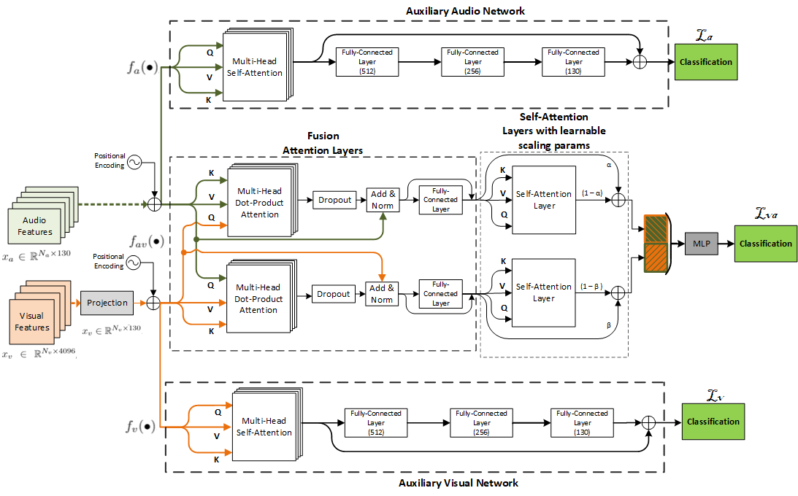

# AuxFormer
AuxFormer: Robust Approach to Audiovisual Emotion Recognition

## Abstract
A challenging task in audiovisual emotion recognition is to implement neural network architectures that can leverage and fuse multimodal information while temporally aligning modalities, handling missing modalities, and capturing information from all modalities without losing information during training. These requirements are important to achieve model robustness and to increase accuracy on the emotion recognition task. A recent approach to perform multimodal fusion is to use the transformer architecture to properly fuse and align the modalities. This study proposes the AuxFormer framework, which addresses in a principled way the aforementioned challenges. AuxFormer combines the transformer framework with auxiliary networks. It uses shared losses to infuse information from single-modality networks that are separately embedded. The extra layer of audiovisual information added to our main network retains information that would otherwise be lost during training.

### Paper
Lucas Goncalves and Carlos Busso, "AuxFormer: Robust approach to audiovisual emotion recognition," in IEEE International Conference on Acoustics, Speech and Signal Processing (ICASSP 2022), Singapore, May 2022.

## Using model

#### Update (10/31/2022): 

Updated codes for easier implementation of the model and feature extracting. Releasing corpora partitions for experimental evaluations and features to be used. In this update, we are releasing the wav2vec2 features and EMOCA features version. Opensmile and VGG-Face features are being updated for upcoming release.

### Dependencies
* Python 3.9.7
* Pytorch 1.12.0
* To create conda environment based on requirements use: `conda install --name AuxFormer_env --file requirements.txt`
* Note: `pip install transformers` is needed after creating env
* Activate environment with: `conda activate AuxFormer_env`

### Datasets Used
1. [CREMA-D.](https://www.ncbi.nlm.nih.gov/pmc/articles/PMC4313618/) 
2. [MSP-IMPROV](https://ecs.utdallas.edu/research/researchlabs/msp-lab/MSP-Improv.html)

### Features & Partitions
* Access to features/partitions [here](https://drive.google.com/drive/folders/1praR2Hwj1b70NQUPh8JC_pRvDJTPMx9t?usp=sharing)
Note: Five pre-set partitions are provided using three different labelling methods P - plurality rule, M - majority rule, and D - distributional.
The video features provided in this drive are [EMOCA](https://github.com/radekd91/emocafeatures) features. Audios can be obtained by directly downloading the [CREMA-D.](https://www.ncbi.nlm.nih.gov/pmc/articles/PMC4313618/)  dataset from source and processing the files with `AuxFormer/pre-processing/crema_auds.py`. VGG-Face features to be uploaded. 

### Scripts
For more details make sure to visit these files to look at script arguments and description:

`AuxFormer/run_model.sh ` - main script with input setting and run/infer model

`AuxFormer/utils` - utils folder containing loss manager, data_manager, feature extractor, normalizer, etc.

`AuxFormer/config` - config files with information about datasets

`AuxFormer/net` - model wrapper and Auxformer framework

`AuxFormer/train.py ` - training script

`AuxFormer/test.py` - inference script

`AuxFormer/modules/` - folder containing tranformer framework and position_embedding configurations

### Running the Algorithm
1. Download dataset and data partitions specifications. Place data and partitions inside a folder called data like: `AuxFormer/data`
   
   Folder should contain the following. CREMA-D example: `AuxFormer/data/Audios`, `AuxFormer/data/Videos`, `AuxFormer/data/labels_consensus_6class_X`
   
1. If using wav2vec2 features. [Download](https://drive.google.com/drive/folders/1A_j_PgFuURTHriN1vEWkTlqWJQ5vEoyc?usp=sharing) wav2vec2 model for audio feature extraction and place folder in `AuxFormer/wav2vec2-large-robust-finetunned`
     
2. Execute run_model.sh

       `conda activate AuxFormer_env`
       `bash run_model.sh`
       
## Framework

The AuxFormer framework, which consists of the main audiovisual fusion network (middle) labelled fav(•), the auxiliary acoustic
network (top) labelled fa(•), and the auxiliary visual network (bottom) labelled fv(•).

## If anything here has been useful. Please cite:

Lucas Goncalves and Carlos Busso, "Robust audiovisual emotion recognition: Aligning modalities, capturing temporal information, and handling missing features," IEEE Transactions on Affective Computing, vol. early access, 2022.

Lucas Goncalves and Carlos Busso, "AuxFormer: Robust approach to audiovisual emotion recognition," in IEEE International Conference on Acoustics, Speech and Signal Processing (ICASSP 2022), Singapore, May 2022. 

  

